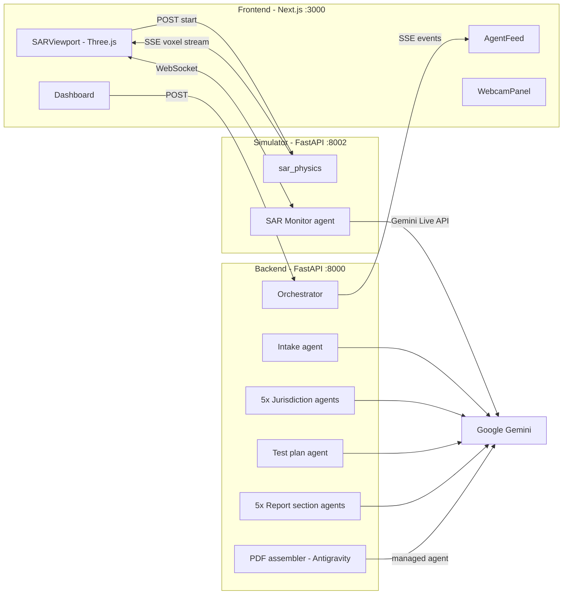

# LabPilot

**Autonomous wireless certification testing, powered by 11 Gemini agents.**

> Wireless device FCC/CE/ISED certification takes **3 weeks** and **$50K** per device today. LabPilot collapses that to **minutes** -- enabling RF engineers to iterate on hardware designs at the speed of software.

[**Watch the 1-minute demo**](INSERT_VIDEO_URL_HERE) | [Live deployment](INSERT_DEPLOY_URL_HERE) | [Architecture](#architecture)

---

## What it does

Point a camera at any wireless device. LabPilot does the rest:

1. **Identifies** the device from a single webcam frame -- make, model, form factor, radios -- using Gemini multimodal vision.
2. **Analyzes** regulatory requirements across 5 jurisdictions (FCC, EU RED, ISED Canada, Japan MIC, ANATEL Brazil) in parallel.
3. **Drafts** a complete test plan with citations.
4. **Simulates** a volumetric SAR scan using a physics-based digital twin in real-time 3D, with grid and phantom geometry adapted to the detected device class.
5. **Detects** anomalies live via a WebSocket SAR monitor agent.
6. **Generates** a multi-page certification report (PDF, with charts and per-jurisdiction pass/fail).

All in under 2 minutes. No dropdowns, no manual configuration -- the device classifies itself.

> **Vision -> Text pipeline:** The webcam identification result is converted into a structured BOM (device name, chips, frequencies, power, form factor), which then feeds the 11-agent text pipeline. **One photo bootstraps the entire compliance workflow.**

## Why it's different

| Most "AI compliance" tools | LabPilot |
|---|---|
| Single LLM call producing a checklist | 11 Gemini agents orchestrated in parallel + sequential pipelines |
| Text-only input | Multimodal -- vision identifies devices from a webcam photo, verifies probe positioning |
| LLM hallucinated "lab results" | Physics-based SAR simulator (inverse-square + Gaussian hotspot) |
| One device type | Auto-adapts grid, phantom, anomaly center for 7 device classes |
| Generic PDF | Antigravity managed agent autonomously renders charts and assembles the PDF in a sandboxed Linux env |

## Quick start (local, 3 terminals)

```bash
# 1. Add your Gemini API key
cp labpilot/.env.example labpilot/.env   # or create .env manually
echo "GEMINI_API_KEY=your_key_here" >> labpilot/.env

# Terminal 1: backend
cd labpilot/backend
python3 -m venv venv && source venv/bin/activate
pip install -r requirements.txt
python -m uvicorn main:app --port 8000 --reload

# Terminal 2: simulator
cd labpilot/simulator
python3 -m venv venv && source venv/bin/activate
pip install -r requirements.txt
python -m uvicorn main:app --port 8002 --reload

# Terminal 3: frontend
cd labpilot/frontend
npm install && npm run dev
```

Open **http://localhost:3000**.

## Architecture



## Multi-device support

The intake agent classifies devices from BOM text. The entire pipeline adapts:

| Form Factor | Phantom | Grid Size | Example |
|---|---|---|---|
| Handset | Flat body | 16x16x5 cm | Phones, portable radios |
| Tablet | Large flat | 20x28x4 cm | Tablets, e-readers |
| Wearable | Small body | 8x8x3 cm | Watches, patches, bands |
| Laptop | Wide flat | 28x20x4 cm | Laptops, portable PCs |
| IoT | Compact | 10x10x4 cm | Sensors, trackers, boards |
| Speaker | Desktop | 12x12x5 cm | Smart speakers, hubs |
| Gateway | Desktop | 12x12x5 cm | Routers, access points |

The 3D viewport, simulator grid geometry, anomaly position, radio frequency/power, and PDF chart labels all adapt automatically.

## Demo walkthrough

1. **Identify device** -- Point a webcam at any wireless device. Gemini Vision verifies setup and identifies the device (make, model, radios, form factor). The result is converted to a structured BOM and auto-populates the project text -- no typing required.
2. **Create project + scope** -- Click the create button. The 11-agent text pipeline kicks off using the BOM that was generated from the photo. Watch agents stream events in real-time on the left panel. The intake agent's `device_profile` event tells the rest of the stack what kind of device it is.
3. **Initialize scan** -- The 3D voxel cloud streams in, color-graded blue -> teal -> amber. The phantom mesh and grid bounds adapt to the detected device class. The robot arm tracks the scan position. Around 70% through, the planted anomaly fires -- the SAR monitor agent emits a critical alert that gets injected into the agent feed.
4. **Generate report** -- The 5 report-section agents run in parallel. The Antigravity managed agent autonomously assembles the final PDF with matplotlib charts inside a sandboxed Linux environment. Download link appears in the feed.

## Honest framing

The SAR data is generated by a physics-based digital twin simulator -- not a substitute for a physical SPEAG DASY8 measurement campaign. In production, the simulator stream would be replaced by real lab instrument exports. The regulatory analysis, citations, test plan, and report prose are produced by Gemini agents.

## Tech stack

- **Frontend:** Next.js 16, React, Three.js, React Three Fiber, TypeScript
- **Backend:** Python 3.13, FastAPI, Google Gemini (`google-genai`), Pydantic, ReportLab, Matplotlib
- **Simulator:** Python 3.13, FastAPI, NumPy, WebSocket SAR monitor with Gemini Live API
- **AI:** Gemini 3.5 Flash (11 agents), Managed Agents / Antigravity (PDF assembly), Multimodal Vision (setup verification + device identification)
- **Streaming:** Server-Sent Events (agent pipeline + voxel scan) + WebSocket (live SAR monitor)
- **Deployment:** Docker + Google Cloud Run

## Repository structure

```
LapPilot/
  labpilot/
    backend/      # FastAPI + 11 Gemini agents + Antigravity assembler
    simulator/    # SAR physics + monitor agent
    frontend/     # Next.js + Three.js dashboard
    contracts/    # Shared TypeScript types
```

## Team

Built at the Google I/O Hackathon 2026.

---

**License:** MIT
